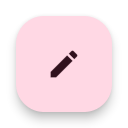

# material_widgets

An Flutter package implementing various Material Design 3 components and layout patterns. It uses my [material_you](https://github.com/KalilDev/material_you), [flutter_monet_theme](https://github.com/KalilDev/material_theme_reverse/tree/master/dart/flutter_monet_theme), [monet_theme](https://github.com/KalilDev/material_theme_reverse/tree/master/dart/monet_theme) and [palette_from_wallpaper](https://github.com/KalilDev/palette_from_wallpaper) packages in order to implement the MD3 theming, and builds on top of them to implement the MD3 components.

## Gallery

The Material Design 3 Gallery contains every component from this package and is available through an release APK on the [Releases page](https://github.com/KalilDev/material_widgets/releases), or through the web [Here](https://kalildev.github.io/material_widgets/).

### Screenshots

## Styling

### Typography

An fully device-type aware implementation of the [Material Design 3](https://m3.material.io/) [Typography](https://m3.material.io/styles/typography/overview)

#### Images

### Color system

An fully fledged implementation of the [Material Design 3](https://m3.material.io/) [Color System](https://m3.material.io/styles/color/the-color-system/key-colors-tones). It supports an baseline theme, wallpaper-based seeded themes, themes from custom seeds, and custom harmonized colors

#### Images

### Elevation

An fully fledged implementation of the [Material Design 3](https://m3.material.io/) Elevation, with 5 different levels, each with an different shadow and surface tint.

#### Images

## Components:

### Cards

Some components which follow the [Material Design 3](https://m3.material.io/) spec
for the [Cards](https://m3.material.io/components/cards), and an extra ColoredCard.

#### Images

### Chips

Some components which follow the [Material Design 3](https://m3.material.io/) spec
for the [Chips](https://m3.material.io/components/chips/overview).

#### Images

### Common Buttons

An style for Elevated, Text and Outlined buttons, and Filled and FiledTonal buttons which follow the [Material Design 3](https://m3.material.io/) spec
for the [Common Buttons](https://m3.material.io/components/buttons/overview).

#### Images

### Dialogs

Basic and fullscreen dialogs and animations which follow the [Material Design 3](https://m3.material.io/) spec
for the [Dialogs](https://m3.material.io/components/dialogs/overview).

#### Images

### Appbars

Various appbars and an sliver appbar which follow the [Material Design 3](https://m3.material.io/) spec
for the [Top app bar](https://m3.material.io/components/top-app-bar/overview).

#### Images

### Switch

An guesstimate of what the [Material Design 3](https://m3.material.io/) switch component will look like (Based of the measures and eyeballing from the Google Clock app).

#### Images

### Slider

An guesstimate of what the [Material Design 3](https://m3.material.io/) slider component will look like (Based of the eyeballing of the Material You advertising videos).

#### Images

### MD3FloatingActionButton

An component which follows the [Material Design 3](https://m3.material.io/) spec
for the [FAB](https://m3.material.io/components/floating-action-button) and
[Extended FAB](https://m3.material.io/components/extended-fab) components.

#### Images
##### Regular
| Color Scheme     |                             Regular (light)                              |                                      Lowered (light)                                       |                                Regular (dark)                                 |                                         Lowered (dark)                                          |
| :--------------- | :----------------------------------------------------------------------: | :----------------------------------------------------------------------------------------: | :---------------------------------------------------------------------------: | :---------------------------------------------------------------------------------------------: |
| primaryContainer |  |  |  |  |
| surface          |                      |                      |                      |                      |
| secondary        |                  |                  |                  |                  |
| tertiary         |                    |                    |                    |                    |

##### Small
| Color Scheme     |                           Regular (light)                            |                                    Lowered (light)                                     |                              Regular (dark)                               |                                       Lowered (dark)                                        |
| :--------------- | :------------------------------------------------------------------: | :------------------------------------------------------------------------------------: | :-----------------------------------------------------------------------: | :-----------------------------------------------------------------------------------------: |
| primaryContainer |  |  |  |  |
| surface          |                      |                      |                      |                      |
| secondary        |                  |                  |                  |                  |
| tertiary         |                    |                    |                    |                    |

##### Large
| Color Scheme     |                           Regular (light)                            |                                    Lowered (light)                                     |                              Regular (dark)                               |                                       Lowered (dark)                                        |
| :--------------- | :------------------------------------------------------------------: | :------------------------------------------------------------------------------------: | :-----------------------------------------------------------------------: | :-----------------------------------------------------------------------------------------: |
| primaryContainer |  |  |  |  |
| surface          |                      |                      |                      |                      |
| secondary        |                  |                  |                  |                  |
| tertiary         |                    |                    |                    |                    |

##### Expanded
| Color Scheme     |                                      Regular (light)                                       |                                               Lowered (light)                                                |                                         Regular (dark)                                          |                                                  Lowered (dark)                                                   |
| :--------------- | :----------------------------------------------------------------------------------------: | :----------------------------------------------------------------------------------------------------------: | :---------------------------------------------------------------------------------------------: | :---------------------------------------------------------------------------------------------------------------: |
| primaryContainer | _Primary_Container.png) | _Primary_Container_Lowered.png) | _Primary_Container.png) | _Primary_Container_Lowered.png) |
| surface          |           _Surface.png)           |           _Surface_Lowered.png)           |           _Surface.png)           |           _Surface_Lowered.png)           |
| secondary        |         _Secondary.png)         |         _Secondary_Lowered.png)         |         _Secondary.png)         |         _Secondary_Lowered.png)         |
| tertiary         |          _Tertiary.png)          |          _Tertiary_Lowered.png)          |          _Tertiary.png)          |          _Tertiary_Lowered.png)          |

##### Expanded (No icon)
| Color Scheme     |                                        Regular (light)                                         |                                                 Lowered (light)                                                  |                                           Regular (dark)                                            |                                                    Lowered (dark)                                                     |
| :--------------- | :--------------------------------------------------------------------------------------------: | :--------------------------------------------------------------------------------------------------------------: | :-------------------------------------------------------------------------------------------------: | :-------------------------------------------------------------------------------------------------------------------: |
| primaryContainer | _Primary_Container.png) | _Primary_Container_Lowered.png) | _Primary_Container.png) | _Primary_Container_Lowered.png) |
| surface          |           _Surface.png)           |           _Surface_Lowered.png)           |           _Surface.png)           |           _Surface_Lowered.png)           |
| secondary        |         _Secondary.png)         |         _Secondary_Lowered.png)         |         _Secondary.png)         |         _Secondary_Lowered.png)         |
| tertiary         |          _Tertiary.png)          |          _Tertiary_Lowered.png)          |          _Tertiary.png)          |          _Tertiary_Lowered.png)          |

##### Expanded (Closed)
| Color Scheme     |                                       Regular (light)                                        |                                                Lowered (light)                                                 |                                          Regular (dark)                                           |                                                   Lowered (dark)                                                    |
| :--------------- | :------------------------------------------------------------------------------------------: | :------------------------------------------------------------------------------------------------------------: | :-----------------------------------------------------------------------------------------------: | :-----------------------------------------------------------------------------------------------------------------: |
| primaryContainer | _Primary_Container.png) | _Primary_Container_Lowered.png) | _Primary_Container.png) | _Primary_Container_Lowered.png) |
| surface          |           _Surface.png)           |           _Surface_Lowered.png)           |           _Surface.png)           |           _Surface_Lowered.png)           |
| secondary        |         _Secondary.png)         |         _Secondary_Lowered.png)         |         _Secondary.png)         |         _Secondary_Lowered.png)         |
| tertiary         |          _Tertiary.png)          |          _Tertiary_Lowered.png)          |          _Tertiary.png)          |          _Tertiary_Lowered.png)          |

## Getting Started

This project is a starting point for a Dart
[package](https://flutter.dev/developing-packages/),
a library module containing code that can be shared easily across
multiple Flutter or Dart projects.

For help getting started with Flutter, view our 
[online documentation](https://flutter.dev/docs), which offers tutorials, 
samples, guidance on mobile development, and a full API reference.
